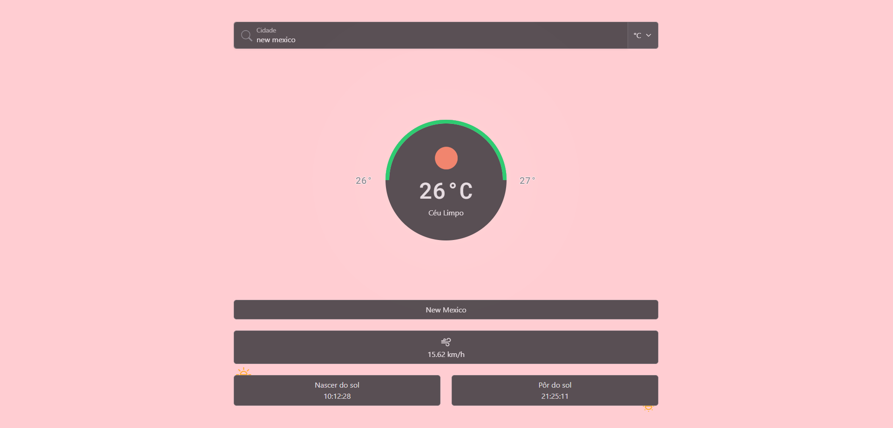

# BreezyFetch

O BreezyFetch é um site que permite aos usuários pesquisar informações climáticas usando a API OpenWeather. Os usuários podem buscar o nome da cidade desejada e obter dados sobre temperatura, condições climáticas, velocidade do vento e etc.  
Foi desenvolvido como atividade para a disciplina de Webservices do IFSEMG.

## Como usar

1. Clone o repositório
2. Inicie o BreezyFetch abrindo o arquivo `index.html`
3. Digite o nome da cidade desejada
4. Clique no botão de busca ou tecle $enter$

## Tecnologias

- HTML
- CSS
- JavaScript
- Bootstrap
- JQuery
- API OpenWeather

## Recursos

1. Busca de clima por cidade
2. Escolha de métricas (Celsius, Kelvin ou Fahrenheit)
3. Armazenamento da métrica escolhida em localStorage
4. Alteração de cor de fundo baseada na temperatura

## Imagens

Estado inicial (tela 2560px):

Busca realizada (tela 2560px):

Busca realizada (tela 768px):

Busca realizada (tela 320px):

  
